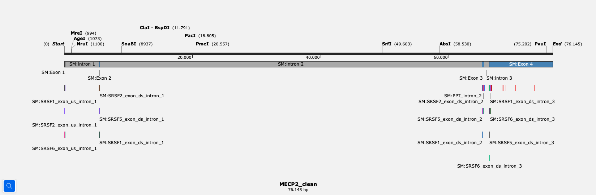
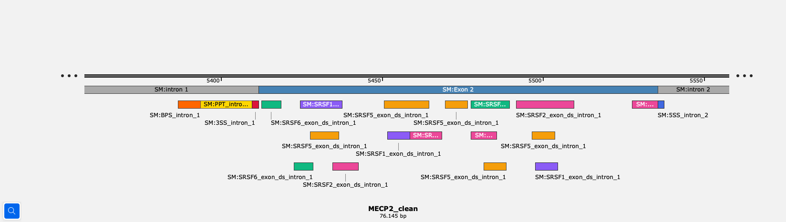

# splicemap

Annotate splicing regulatory elements on genomic DNA sequences.

## What It Does

Given a genomic sequence (GenBank format) and an mRNA transcript accession, splicemap discovers exon boundaries by aligning the transcript against the genomic DNA, annotates the resulting introns, and maps all splicing regulatory elements: 5' and 3' splice sites, branch points, polypyrimidine tracts, exonic splicing enhancers (ESE), and exonic splicing silencers (ESS). Output is written back to the GenBank file — viewable in SnapGene or UGENE — with a companion markdown report.

## Quick Start

```bash
git clone https://github.com/maxwraae/splicemap.git
cd splicemap
pip install -r requirements.txt
python splicemap.py splicemap examples/MECP2_CS.gb -t NM_004992.4
```

## Example Output


*Full MECP2 gene (76 kb) showing exons, introns, and ESE/ESS sites annotated by splicemap.*


*Zoomed into Exon 2: branch point (orange), PPT (gold), 3'SS, and ESE sites (SRSF1/2/5/6) in distinct colors.*

```
Found 3 intron(s)
  intron 1: 116-5411 (5,296 bp)
  intron 2: 5536-65161 (59,626 bp)
  intron 3: 65512-66267 (756 bp)

Splice Map: MECP2_CS (76,145 bp, linear)
============================================================

Intron                 Length     5'SS     3'SS   BPS(z)   PPT%
-------------------- -------- -------- -------- -------- ------
intron 1               5,296    -15.5      0.1      6.6    75%
intron 2              59,626    -15.6     -4.7      6.2    63%
intron 3                 756     10.1     12.4      6.6    80%

Exon                 Length  ESEfinder  hnRNP  ESRseq+  ESRseq-
-------------------- ------  ---------  -----  -------  -------
exon_us_intron_1       114         25      0       63       13
exon_ds_intron_1       124         22      0       24       37
exon_ds_intron_2       351         57      1      118       69
exon_ds_intron_3      9878       1436     55     2232     3125
```

The annotated GenBank file can be opened in SnapGene or UGENE to visualize all annotations with color-coded features.

## What Gets Annotated

| Element | Method | Color |
|---------|--------|-------|
| 5' Splice Site (5'SS) | MaxEntScan | Royal Blue |
| 3' Splice Site (3'SS) | MaxEntScan | Crimson |
| Branch Point (BPS) | BPP | Orange |
| Polypyrimidine Tract (PPT) | Pyrimidine density | Gold |
| SRSF1 binding (ESE) | ESEfinder | Violet |
| SRSF2 binding (ESE) | ESEfinder | Pink |
| SRSF5 binding (ESE) | ESEfinder | Amber |
| SRSF6 binding (ESE) | ESEfinder | Emerald |
| ESRseq enhancer (ESE) | ESRseq hexamer lookup | Green |
| ESRseq silencer (ESS) | ESRseq hexamer lookup | Orange |
| hnRNP A1 binding (ESS) | Motif matching | Red |
| hnRNP H binding (ESS) | G-run detection | Dark Red |

Splicemap reads exon annotations from the input GenBank file (it does not annotate exons or introns itself). Download your gene as a RefSeqGene from [NCBI Gene](https://www.ncbi.nlm.nih.gov/gene/) to get a file with exon annotations already included.

## How the scoring works

Splicemap uses several published methods to identify splicing regulatory elements. Each has different strengths and limitations.

### Splice sites: MaxEntScan

Scores the 5' and 3' splice site sequences using maximum entropy models trained on known human splice sites. A score above 6 is strong, 3-6 is moderate, below 3 is weak.

Canonical introns start with GT (5' splice site) and end with AG (3' splice site). Non-canonical dinucleotides are flagged as warnings.

*Reference:* Yeo & Burge, "Maximum entropy modeling of short sequence motifs with applications to RNA splicing signals", Journal of Computational Biology, 2004. [PubMed](https://pubmed.ncbi.nlm.nih.gov/15285897/)

### Branch point: BPP

Predicts the branch point adenosine using a position weight matrix trained on experimentally verified human branch points. Reports a z-score (above 2 is strong). The branch point is typically 18-40 nucleotides upstream of the 3' splice site.

*Reference:* Zhang, "A branch point prediction tool", [GitHub: zhqingit/BPP](https://github.com/zhqingit/BPP)

### Exonic splicing enhancers: ESEfinder

Slides a position weight matrix across exon sequences to predict binding sites for four specific SR proteins: SRSF1 (SF2/ASF), SRSF2 (SC35), SRSF5 (SRp40), and SRSF6 (SRp55). The matrices were derived from SELEX experiments where each purified protein was tested against random RNA libraries in vitro.

**What it tells you:** Which of these 4 SR proteins likely binds at each position.

**What it misses:** All other SR proteins (SRSF3, SRSF7, Tra2-beta, RBFOX, and others). The in vitro binding preferences may not reflect in vivo activity where RNA structure, competing proteins, and cellular context all play a role. Accuracy on known splicing mutations is approximately 44%.

*Reference:* Cartegni et al., "ESEfinder: a web resource to identify exonic splicing enhancers", Nucleic Acids Research, 2003. [PubMed](https://pubmed.ncbi.nlm.nih.gov/12824367/)

### Exonic regulatory elements: ESRseq

Looks up each 6-mer (hexamer) in the exon against a table of 2,272 hexamers with measured splicing activity scores. Positive scores indicate the hexamer promotes exon inclusion (enhancer). Negative scores indicate it promotes exon skipping (silencer).

The scores were measured experimentally: every possible hexamer was inserted into the same position in a test exon, transfected into cells, and the effect on splicing was quantified by RNA-seq. This captures the net effect of all splicing regulatory proteins, not just the four that ESEfinder covers.

**What it tells you:** Whether a region of the exon actually promotes inclusion or skipping, with a quantitative score.

**What it misses:** Which specific protein is responsible for the effect. The scores come from one specific minigene context (HBB exon 2), so activity may differ in other exon contexts. Does not capture combinatorial effects between adjacent elements.

Accuracy on known splicing mutations is approximately 83%.

*Reference:* Ke et al., "Quantitative evaluation of all hexamers as exonic splicing elements", Genome Research, 2011. [PubMed](https://pubmed.ncbi.nlm.nih.gov/21659425/)

### Exonic splicing silencers: hnRNP motifs

Searches for known binding motifs of two hnRNP proteins using pattern matching: hnRNP A1 (consensus TAGG[GT][TA]) and hnRNP H (G-runs of 4 or more).

**What it misses:** Most silencer proteins. PTBP1 (a major splicing repressor), hnRNP C, hnRNP F, TDP-43, and many others are not covered. For broader silencer detection, the ESRseq negative scores are more comprehensive.

*References:* Burd & Dreyfuss, "RNA binding specificity of hnRNP A1", EMBO Journal, 1994. Caputi & Bhatt, "A G-rich element forms a novel structure at a silencer", Biochemistry, 2003.

### What splicemap does NOT detect

- **RNA secondary structure.** A binding site buried in a hairpin may be inaccessible. Splicemap scans flat sequence only.
- **Position-dependent effects.** ESEs near splice sites generally matter more than those in the exon center. No positional weighting is applied.
- **Combinatorial interactions.** Two weak enhancers next to each other may have a stronger effect than either alone. Not modeled.
- **Cell-type specific regulation.** Splicing factor expression varies between cell types. The same exon may be included in neurons but skipped in liver. Splicemap gives you the sequence-level potential, not the cell-type outcome.
- **Most splicing silencer proteins.** Only hnRNP A1 and hnRNP H are detected by motif. Use ESRseq negative scores for broader silencer coverage.

## Commands

### Reading and inspection

| Command | Description |
|---------|-------------|
| `read <file>` | Parse .gb/.fasta, show clean summary |
| `features <file>` | List all annotations as a table |
| `seq <file> <start> <end>` | Extract a sequence region (1-based) |
| `translate <file> <start> <end>` | Extract a region and translate to protein |
| `search <file> <sequence>` | Find all occurrences of a DNA motif (both strands) |
| `orfs <file>` | Find ORFs |
| `sites <file>` | Find restriction sites |
| `current` | Show files currently open in UGENE |
| `open <file>` | Open file in default viewer (UGENE/SnapGene) |

### Annotation

| Command | Description |
|---------|-------------|
| `splicemap <file> -t <accession>` | Full splice map: discover exons, annotate all splicing elements |
| `exons <file> --transcript <accession>` | Find and optionally annotate exon boundaries from mRNA alignment |
| `annotate <file> <start> <end> <label>` | Add a feature annotation |
| `annotate-seq <file> <sequence> <label>` | Find a sequence and annotate its position |
| `splice-signals <file>` | Annotate 5'SS, 3'SS, BPS, PPT on detected or specified introns |
| `branchpoint <file>` | Predict branch point locations in introns |
| `remove <file> <label>` | Remove an annotation by label |

### Sequence editing

| Command | Description |
|---------|-------------|
| `insert <file> <position> <sequence>` | Insert a DNA sequence, shifting downstream features |
| `delete <file> <start> <end>` | Delete a region, shifting downstream features |
| `replace <file> <start> <end> <sequence>` | Replace a region with a new sequence |
| `revcomp <file>` | Reverse complement the sequence |

### Analysis

| Command | Description |
|---------|-------------|
| `diff <file1> <file2>` | Compare two constructs |
| `blast <file>` | Run a remote NCBI BLAST search |
| `stitch <file> [labels...]` | Extract annotated regions, stitch together, optionally translate |
| `check <file>` | Preflight validation of a construct |
| `gibson <file> --enzymes E1,E2 --insert SEQ` | Design Gibson assembly eBlocks |
| `varmap <file> <variants_csv>` | Visualize variant positions mapped onto a sequence |
| `export <file> <format>` | Convert between formats: fasta, genbank, tab (feature TSV) |

## Dependencies

```
Python 3.8+
pip install -r requirements.txt  # biopython, pydna
```

Branch point prediction tools (BPP, SVM-BPfinder) are automatically downloaded on first use. No manual setup required.

## External Services

- **NCBI Entrez**: Used to fetch mRNA transcripts for exon discovery. Requires internet connection.
- **NCBI BLAST**: Optional remote BLAST searches via the `blast` command.
- **IDT API**: Optional complexity screening for synthesis orders. Set `IDT_API_KEY` environment variable to enable.

## License

GPLv3. See LICENSE file.
